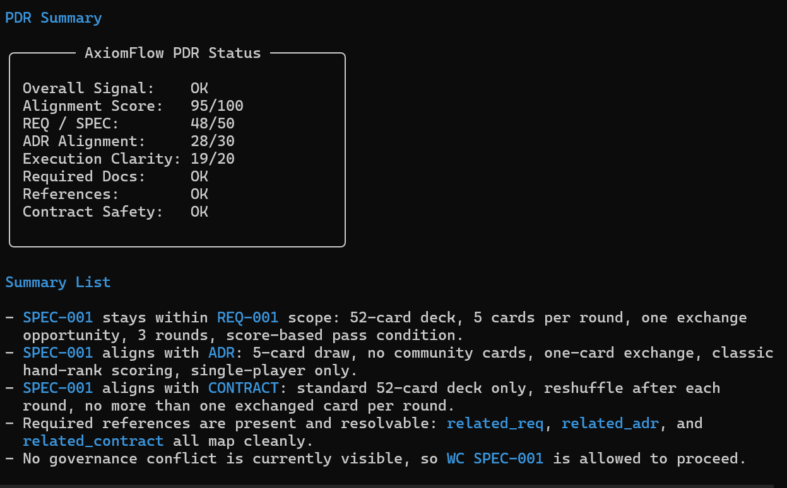
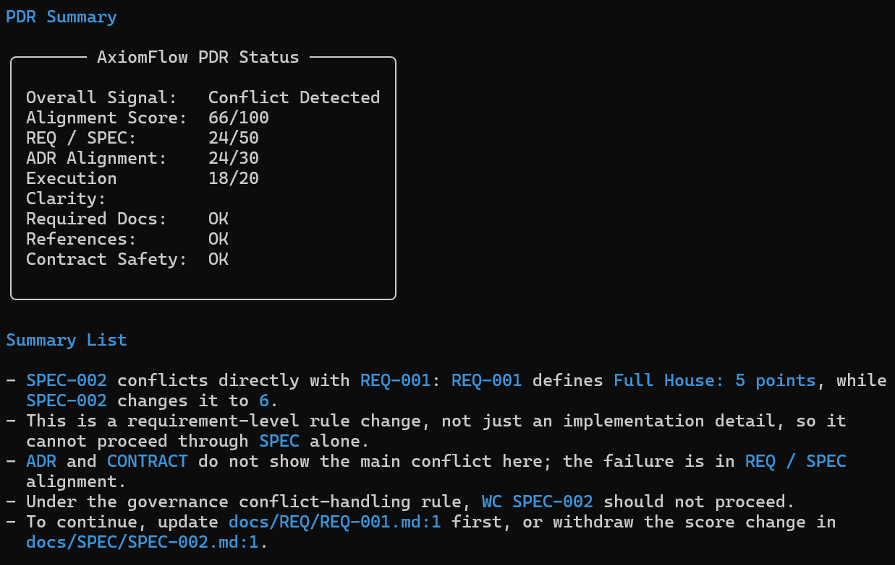
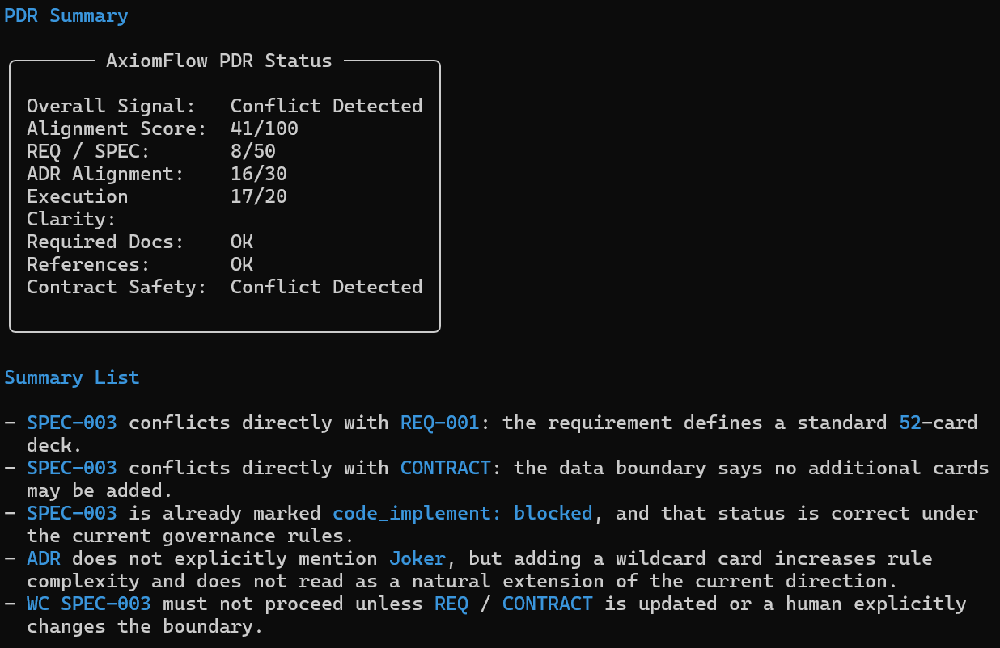

# AxiomFlow


**Turn AI agents into governable builders.**

> Bound acceleration. Trace evolution.

AxiomFlow is a governance model for AI-assisted software delivery.

It helps teams keep AI-driven execution aligned, bounded, and traceable before speed turns into drift.

## Why It Exists

AI can generate requirements, plans, code, and documents at high speed.

That speed is useful until teams lose control of:

- what problem is actually being solved
- why a direction was chosen
- which boundaries are non-negotiable
- whether the current work is still aligned with approved intent

The result is familiar: delivery appears to move faster, but confusion scales with it.

AxiomFlow is designed to prevent that failure mode.

## What AxiomFlow Changes

AxiomFlow does not add process for its own sake.

It separates different kinds of project decisions so they can be governed explicitly:

- `REQ`: what problem must be solved
- `SPEC`: how the work will be executed
- `ADR`: why this direction was chosen
- `CONTRACT`: which boundaries must not be crossed
- `REFLECT`: which lessons are worth preserving
- `SUGGEST`: which repeated lessons may deserve a governance upgrade

When those layers are separated, AI stops acting like a fast content generator and starts acting like a controllable delivery system.

## Current Capability

Today, AxiomFlow `PDR` is more than a pre-work checklist.

It can:

- detect governance conflicts before implementation
- stop execution when `REQ`, `ADR`, or `CONTRACT` boundaries are violated
- render a terminal status layout for fast human review
- make the reason to proceed, review, or stop visible before `WC`

This matters because teams do not need more output. They need earlier judgment.

## PDR In Action

These examples show how the same governance layer produces different outcomes for different specs.

| Spec | Signal | What PDR found |
| --- | --- | --- |
| `SPEC-001` | `OK` | aligned with `REQ`, `ADR`, and `CONTRACT` |
| `SPEC-002` | `Conflict Detected` | changes scoring without updating `REQ` |
| `SPEC-003` | `Conflict Detected` | adds `Joker` and violates the current deck boundary |

This is the product value in one view:

- AxiomFlow does not only help teams write specs
- it helps teams decide whether a spec should proceed at all


### `SPEC-001`

```text
PDR SPEC-001
```



### `SPEC-002`

```text
PDR SPEC-002
```



### `SPEC-003`

```text
PDR SPEC-003
```



## Start Here

If this is your first time in the repo, use this short path:

- [中文 README](./README.zh.md)
- [Getting Started](./Tenets/en/getting-started.md)
- [Version Guide](./Tenets/en/project-scale.md)
- [Upgrade Signals](./Tenets/en/upgrade-signals.md)

## Choose Your Operating Version

- [Simple](./Tenets/en/README.simple.md): for low-conflict work that mainly needs alignment before execution
- [Standard](./Tenets/en/README.standard.md): for teams that need to preserve repeated lessons through `REFLECT`
- [Advanced](./Tenets/en/README.advanced.md): for teams evaluating whether recurring patterns should become `ADR` or `CONTRACT`
- [Professional](./Tenets/en/README.professional.md): for high-conflict environments that require formal approval and stop authority

## Read By Topic

- [Getting Started](./Tenets/en/getting-started.md): set up the repo and the initial operating flow
- [Core Concepts](./Tenets/en/concepts.md): understand role separation across `REQ`, `SPEC`, `ADR`, and `CONTRACT`
- [Workflow](./Tenets/en/workflow.md): see the core loop from alignment to execution
- [Conflict Handling](./Tenets/en/conflict-handling.md): learn when work must stop
- [Feedback Loop](./Tenets/en/feedback-loop.md): see how experience feeds governance
- [Upgrade Signals](./Tenets/en/upgrade-signals.md): know when the current operating model is no longer enough
- [Adoption Guide](./Tenets/en/adoption-guide.md): apply AxiomFlow in a real team
- [Use Cases](./Tenets/en/use-cases.md): see where the model fits best
- [Why This Works](./Tenets/en/why-this-works.md): understand the operating logic behind the model
- [Governance.md](./Tenets/en/Governance.md): read the formal rules
- [Working Samples](./docs): inspect the English working sample set
- [FAQ](./Tenets/en/faq.md): check common questions
- [Contributing](./Tenets/en/CONTRIBUTING.md): contribute to the project

## Language

- English docs: [Tenets/en](./Tenets/en)
- 中文文件: [Tenets/zh](./Tenets/zh/getting-started.md)

## Community

- GitHub Issues: https://github.com/pigsly/AxiomFlow/issues
- X.com @pigslybear
- Contributing: [Tenets/en/CONTRIBUTING.md](./Tenets/en/CONTRIBUTING.md)
- Related project: [ClawMind](https://github.com/pigsly/ClawMind)
