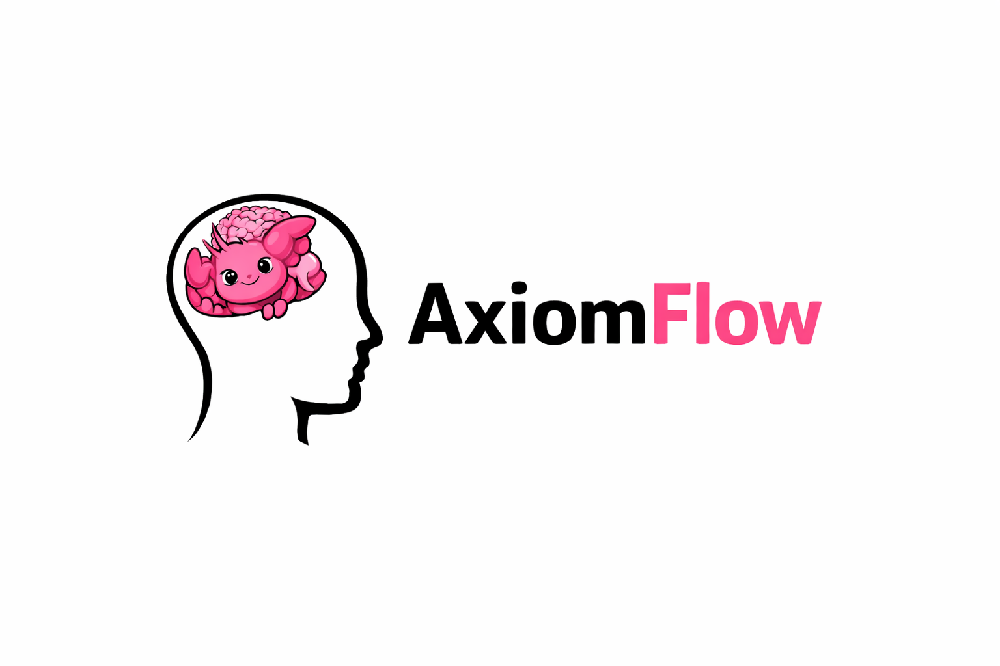

# AxiomFlow

**把 AI agents 變成可治理的建造者。**

> 讓加速有界，讓進化有痕

AxiomFlow 是一套面向 AI 輔助軟體交付的治理模型。

它的目標，是讓 AI 加速下的執行仍然保持對齊、有邊界、且可追溯。

## 從這裡開始

如果你是第一次看這個 repo，先走這條短路徑。

- [English README](./README.md)
- [快速開始](./docs/zh/getting-started.md)
- [怎麼跟 Codex 合作](./docs/zh/how-to-work-with-codex.md)
- [版本指南](./docs/zh/project-scale.md)
- [升級訊號](./docs/zh/upgrade-signals.md)

## 文件角色

每一種文件只回答一個問題：

- `REQ`：要解決什麼問題
- `SPEC_STEP`：這份工作要怎麼執行
- `ADR`：為什麼架構要往這個方向走
- `CONTRACT`：哪些邊界不能被跨越
- `REFLECT`：哪些經驗值得留下
- `SUGGEST`：哪些經驗可能需要升級成治理規則

只使用你在當前階段真正需要的角色。

## 選擇版本

- [簡單版](./docs/zh/README.simple.md)：適合局部、低衝突，主要需求是先做好執行前對齊的工作
- [普通版](./docs/zh/README.standard.md)：適合需要透過 `REFLECT` 保留重複經驗的團隊
- [進階版](./docs/zh/README.advanced.md)：適合需要判斷重複模式是否該升級成 `ADR` 或 `CONTRACT` 的情況
- [專業版](./docs/zh/README.professional.md)：適合高衝突、需要正式批准與停機權限的環境

## 依主題閱讀

- 從 repo setup 開始：[Getting Started](./docs/zh/getting-started.md)
- 先理解怎麼和 agent 合作：[How to Work with Codex](./docs/zh/how-to-work-with-codex.md)
- 了解文件角色分工：[核心概念](./docs/zh/concepts.md)
- 看執行流程怎麼運作：[Workflow](./docs/zh/workflow.md)
- 了解什麼情況必須停機：[Conflict Handling](./docs/zh/conflict-handling.md)
- 看經驗如何回流到治理：[Feedback Loop](./docs/zh/feedback-loop.md)
- 判斷什麼時候需要升級：[Upgrade Signals](./docs/zh/upgrade-signals.md)
- 選擇目前應停留的版本：[Version Guide](./docs/zh/project-scale.md)
- 了解如何導入真實團隊：[Adoption Guide](./docs/zh/adoption-guide.md)
- 看哪些情境最適合這套模型：[Use Cases](./docs/zh/use-cases.md)
- 理解這套模型為什麼成立：[Why This Works](./docs/zh/why-this-works.md)
- 最後再讀正式規則：[Governance.md](./docs/zh/Governance.md)
- 補看常見問題：[FAQ](./docs/zh/faq.md)
- 參考實際範例：[Examples](./docs/zh/examples/README.md)
- 看如何貢獻與修文件：[Contributing](./docs/zh/CONTRIBUTING.md)

## 語言

- English docs: [docs/en](./docs/en/README.md)
- 中文文件: [docs/zh](./docs/zh/getting-started.md)
  
  
