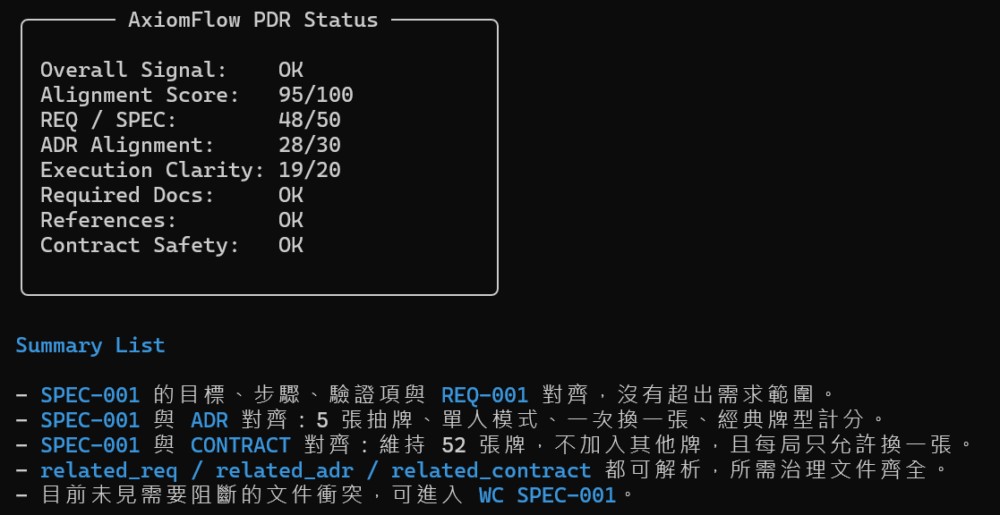
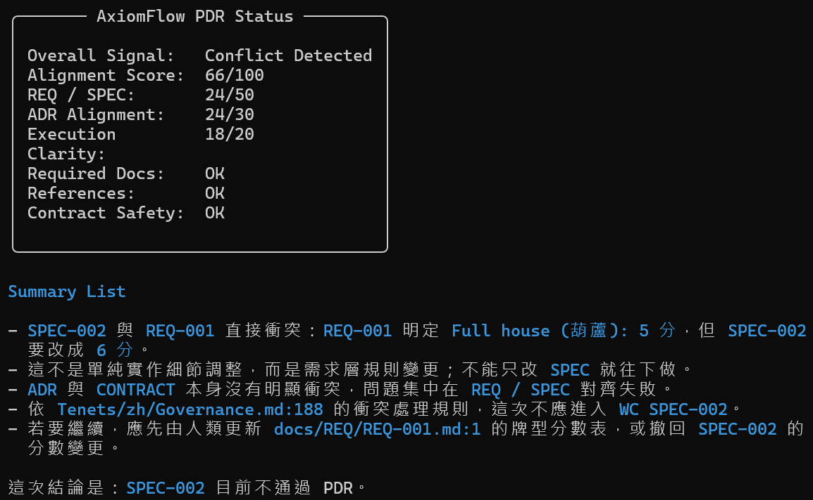
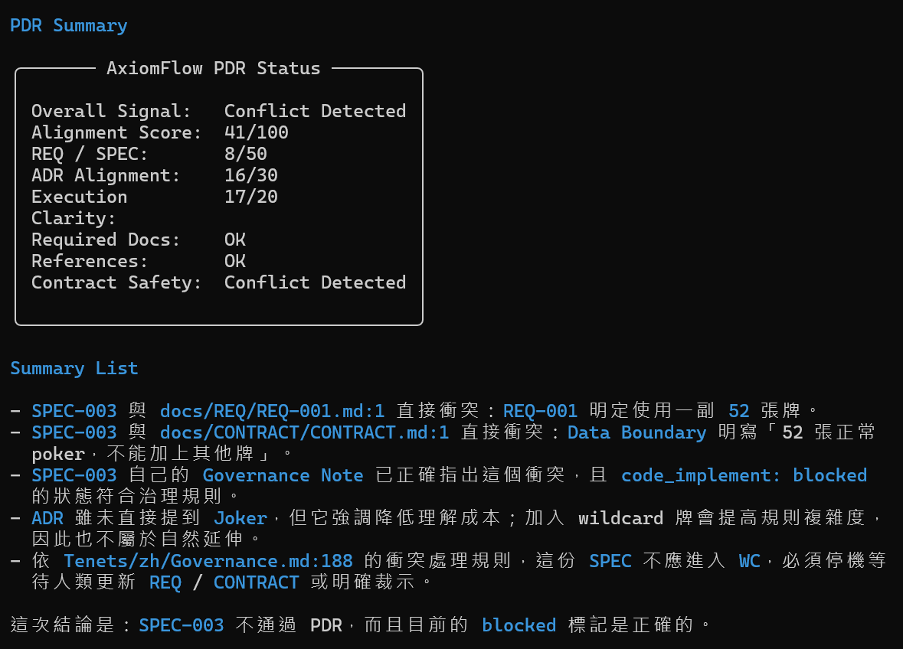

# AxiomFlow


**把 AI agents 變成可治理的建造者。**

> 讓加速有界，讓進化有痕

AxiomFlow 是一套面向 AI 輔助軟體交付的治理模型。

它幫助團隊在 AI 加速執行下，仍然把對齊、邊界與可追溯性留在系統裡，而不是留在人腦裡。

## 它為什麼存在

AI 可以很快產出需求、方案、程式與文件。

但速度一旦超過治理能力，團隊很快就會開始失去對以下事情的控制：

- 現在真正要解的是什麼問題
- 為什麼會選這個方向
- 哪些邊界不能被跨越
- 目前這份工作是否仍然和已批准的意圖一致

最後看起來像是交付變快了，
其實是混亂也一起被放大了。

AxiomFlow 的目的，就是避免這種失控加速。

## AxiomFlow 改變了什麼

AxiomFlow 不是再多加一層流程。

它做的是把不同層次的決策拆開來治理：

- `REQ`：要解決什麼問題
- `SPEC`：這份工作要怎麼執行
- `ADR`：為什麼選這個方向
- `CONTRACT`：哪些邊界不能被跨越
- `REFLECT`：哪些經驗值得留下
- `SUGGEST`：哪些重複經驗可能需要升級成治理規則

當這些層次被分開後，AI 就不再只是高速產出內容，
而是開始變成一個可理解、可控、可交接的交付系統。

## 目前能力

現在的 AxiomFlow `PDR` 已經不只是執行前檢查清單。

它可以：

- 在實作開始前發現治理衝突
- 當 `REQ`、`ADR` 或 `CONTRACT` 邊界被突破時阻斷執行
- 產出 terminal status layout，讓人快速判讀
- 在進入 `WC` 前，明確顯示一份 spec 應該繼續、覆核還是停止

這件事重要，因為團隊真正缺的不是更多輸出，而是更早的判斷。

## PDR 實際長什麼樣

下面這三個案例展示了：同一套治理規則，面對不同 `SPEC`，會得到不同結果。

| Spec | Signal | PDR 看到了什麼 |
| --- | --- | --- |
| `SPEC-001` | `OK` | 與 `REQ`、`ADR`、`CONTRACT` 對齊 |
| `SPEC-002` | `Conflict Detected` | 修改了分數規則，但沒有先更新 `REQ` |
| `SPEC-003` | `Conflict Detected` | 加入 `Joker`，突破了目前的牌組邊界 |

這就是產品價值本身：

- AxiomFlow 不只幫團隊寫出 spec
- 它還幫團隊判斷這份 spec 到底能不能開始做

### `SPEC-001`

```text
PDR SPEC-001
```



### `SPEC-002`

```text
PDR SPEC-002
```



### `SPEC-003`

```text
PDR SPEC-003
```



## 從這裡開始

如果你是第一次看這個 repo，先走這條短路徑：

- [English README](./README.md)
- [快速開始](./Tenets/zh/getting-started.md)
- [版本指南](./Tenets/zh/project-scale.md)
- [升級訊號](./Tenets/zh/upgrade-signals.md)

## 中文樣本與 `docs/`

`Tenets/zh/docs/` 是中文版樣本來源。

如果你需要中文工作樣本，可以直接用 `Tenets/zh/docs/` 的內容替換根目錄 `docs/`。

根目錄 `docs/` 則保留英文版工作樣本，方便作為預設對外展示與英文操作範例。

## 選擇你的操作版本

- [簡單版](./Tenets/zh/README.simple.md)：適合低衝突情境，主要需求是先做好執行前對齊
- [普通版](./Tenets/zh/README.standard.md)：適合需要透過 `REFLECT` 留住重複經驗的團隊
- [進階版](./Tenets/zh/README.advanced.md)：適合開始判斷重複模式是否應升級成 `ADR` 或 `CONTRACT`
- [專業版](./Tenets/zh/README.professional.md)：適合高衝突、需要正式批准與停機權限的環境

## 依主題閱讀

- [快速開始](./Tenets/zh/getting-started.md)：建立最小可用的治理起步組
- [核心概念](./Tenets/zh/concepts.md)：理解 `REQ`、`SPEC`、`ADR`、`CONTRACT` 的角色分工
- [Workflow](./Tenets/zh/workflow.md)：看對齊到執行的主流程
- [Conflict Handling](./Tenets/zh/conflict-handling.md)：了解什麼情況必須停機
- [Feedback Loop](./Tenets/zh/feedback-loop.md)：看經驗如何回流治理
- [Upgrade Signals](./Tenets/zh/upgrade-signals.md)：判斷目前版本何時不夠用
- [Adoption Guide](./Tenets/zh/adoption-guide.md)：把 AxiomFlow 導入真實團隊
- [Use Cases](./Tenets/zh/use-cases.md)：看哪些情境最適合這套模型
- [Why This Works](./Tenets/zh/why-this-works.md)：理解這套模型背後的運作邏輯
- [Governance.md](./Tenets/zh/Governance.md)：閱讀正式治理規則
- [中文樣本](./Tenets/zh/docs)：查看中文版工作樣本
- [FAQ](./Tenets/zh/faq.md)：補看常見問題
- [Contributing](./Tenets/zh/CONTRIBUTING.md)：了解如何貢獻

## 語言

- English docs: [Tenets/en](./Tenets/en)
- 中文文件: [Tenets/zh](./Tenets/zh/getting-started.md)

## Community

- GitHub Issues: https://github.com/pigsly/AxiomFlow/issues
- X.com @pigslybear
- Contributing: [Tenets/zh/CONTRIBUTING.md](./Tenets/zh/CONTRIBUTING.md)
- Related project: [ClawMind](https://github.com/pigsly/ClawMind)
