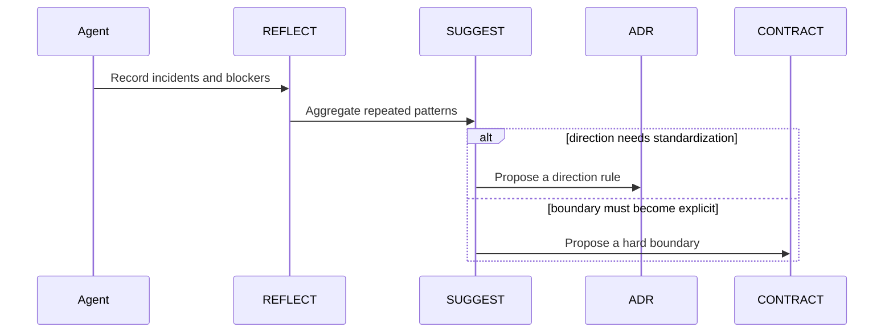

# Advanced

Use this version when:

- multiple modules interact
- problems are no longer isolated bugs
- several `REFLECT` entries point to the same structural issue
- the team needs to decide between `ADR` and `CONTRACT`

## Goal

Advanced turns repeated events into formal governance candidates.

If you are unsure, read [Upgrade Signals](./upgrade-signals.md) and focus on Signals 3 and 4.

## Active Roles

- `REQ`
- `SPEC`
- `ADR`
- `CONTRACT`
- `REFLECT`
- `SUGGEST`

## Core Flow

## What Changes

- `REFLECT` becomes governance evidence
- `SUGGEST` abstracts patterns
- the team must decide whether the issue is directional or boundary-related

## Upgrade Heuristic

Upgrade to `ADR` when:

- architecture direction is unclear
- implementation strategy keeps drifting
- module responsibility needs one shared explanation

Upgrade to `CONTRACT` when:

- cross-module boundaries keep getting crossed
- data ownership is unclear
- control flow is contaminating other modules

## Next

- [Professional](./README.professional.md)
- [Governance.md](./Governance.md)
