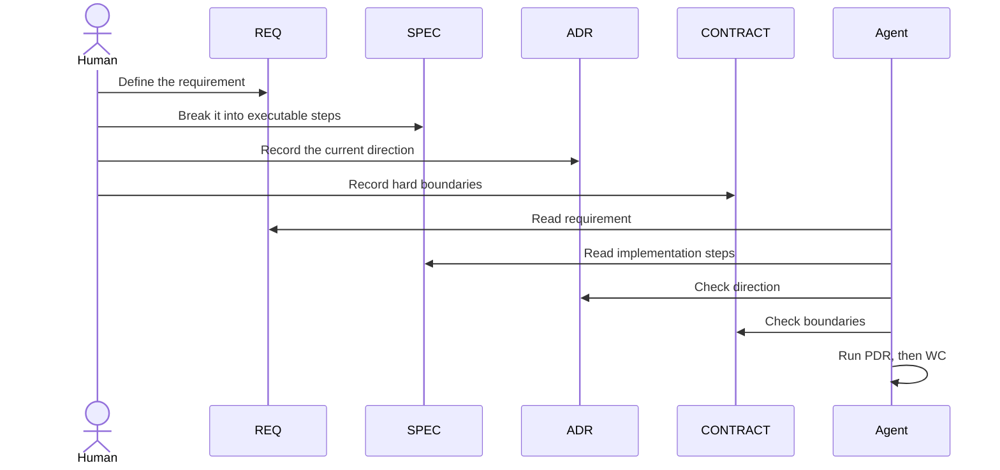

# Simple

Use this version when:

- one person or a small team owns the work
- the system has few modules
- requirements are clear
- the main risk is wrong implementation, not governance drift

## Goal

Simple solves one problem: do not let an agent start implementation before the documents align.

If you are unsure, read [Upgrade Signals](./upgrade-signals.md) and focus on Signal 1.

## Active Roles

- `REQ`
- `SPEC`
- `ADR`
- `CONTRACT`

## Core Flow

## What You Need

- one active `REQ`
- one executable `SPEC`
- one active `ADR`
- one active `CONTRACT`
- `PDR` before each execution

## When Simple Is Enough

Stay here when:

- most changes are local to one module
- `REQ + SPEC` is enough to describe the work
- `ADR` and `CONTRACT` act mainly as guardrails
- repeated mistakes have not become a pattern

## Next

- [Standard](./README.standard.md)
- [Governance.md](./Governance.md)
