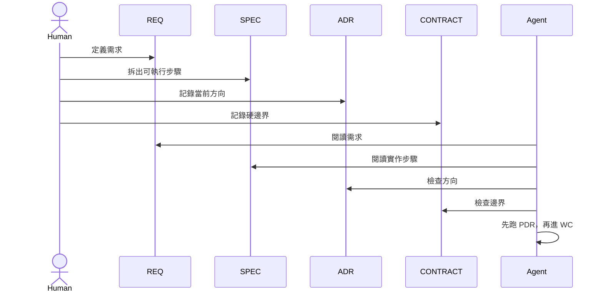

# 簡單版

適用情況：

- 工作主要由一個人或小團隊負責
- 系統模組不多
- 需求相對清楚
- 主要風險是實作做錯，不是治理漂移

## 目標

簡單版只解一件事：不要讓 agent 在文件還沒對齊前就開始實作。

如果你不確定，先讀 [Upgrade Signals](./upgrade-signals.md)，聚焦在 Signal 1。

## 啟用角色

- `REQ`
- `SPEC`
- `ADR`
- `CONTRACT`

## 核心流程

## 你需要什麼

- 一份有效的 `REQ`
- 一份可執行的 `SPEC`
- 一份有效的 `ADR`
- 一份有效的 `CONTRACT`
- 每次執行前都先跑 `PDR`

## 什麼時候簡單版就夠

留在這一版，當：

- 多數改動都還是單一模組內的局部修改
- `REQ + SPEC` 已足夠描述工作
- `ADR` 和 `CONTRACT` 主要還是在當護欄
- 重複錯誤還沒有形成模式

## 下一步

- [普通版](./README.standard.md)
- [Governance.md](./Governance.md)
