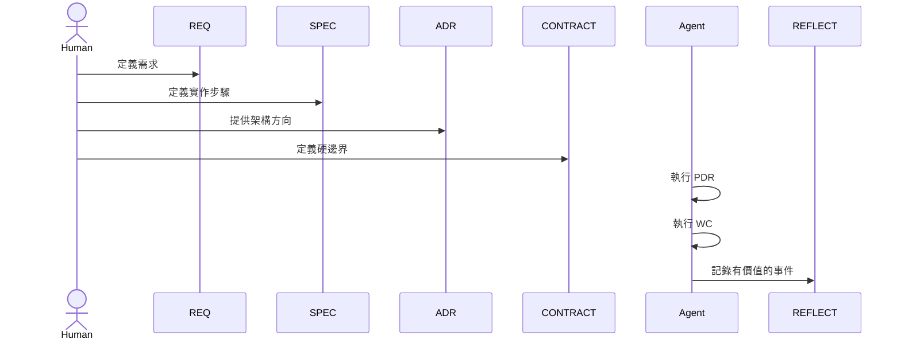

# 普通版

適用情況：

- 有小到中型團隊共同協作
- 某些錯誤開始重複出現
- 你需要一個穩定的 `PDR -> WC -> REFLECT` 迴路

## 目標

普通版是在簡單版上多加一個能力：把重複教訓留下來，而不是每次都靠記憶修同樣的問題。

如果你不確定，先讀 [Upgrade Signals](./upgrade-signals.md)，聚焦在 Signal 2。

## 啟用角色

- `REQ`
- `SPEC`
- `ADR`
- `CONTRACT`
- `REFLECT`

## 核心流程

## 這一版多了什麼

- `PDR` 變成必要條件
- `REFLECT` 成為正常流程的一部分
- 主要路徑變成 `REQ -> SPEC -> PDR -> WC -> REFLECT`

## 什麼時候普通版適合

留在這一版，當：

- 同一類 bug 已經不是第一次出現
- 某些 `SPEC` 一直需要補洞
- 某些重複工作很容易被誤解
- 團隊需要可保存的經驗，而不是只靠聊天記憶

## 下一步

- [進階版](./README.advanced.md)
- [Workflow](./workflow.md)
- [Feedback Loop](./feedback-loop.md)
