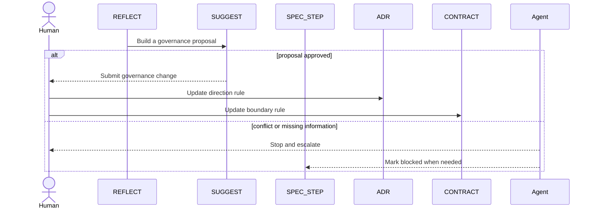

# Professional

Use this version when:

- multiple teams or milestones share the system
- document conflict blocks delivery
- one requirement often impacts another
- formal approval and stop authority are required

## Goal

Professional protects the system from running on the wrong rules.

If you are unsure, read [Upgrade Signals](./upgrade-signals.md) and focus on Signal 5.

## Active Roles

- `REQ`
- `SPEC_STEP`
- `ADR`
- `CONTRACT`
- `REFLECT`
- `SUGGEST`

## Core Flow

## What Changes

- `PDR` becomes a governance gate, not just a pre-work review
- `SUGGEST` can propose but cannot activate
- any inconsistency across `REQ`, `SPEC_STEP`, `ADR`, and `CONTRACT` becomes a stop condition
- human approval is required before `GU`

## When Professional Fits

Use it when:

- changes often require boundary renegotiation
- document conflict interrupts delivery
- the team needs formal approval rights and escalation paths
- writing more code without fixing governance would hide the real problem

## Next

- [Governance.md](./Governance.md)
- [Conflict Handling](./conflict-handling.md)
- [Adoption Guide](./adoption-guide.md)
