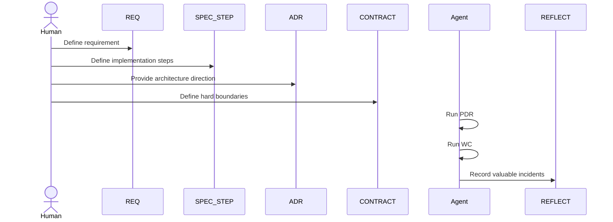

# Standard

Use this version when:

- a small or medium team shares the work
- some mistakes repeat
- you need a stable `PDR -> WC -> REFLECT` loop

## Goal

Standard adds one capability to Simple: preserve repeated lessons instead of fixing the same issue from memory.

If you are unsure, read [Upgrade Signals](./upgrade-signals.md) and focus on Signal 2.

## Active Roles

- `REQ`
- `SPEC_STEP`
- `ADR`
- `CONTRACT`
- `REFLECT`

## Core Flow

## What Changes

- `PDR` is mandatory
- `REFLECT` becomes part of the normal loop
- the main path is `REQ -> SPEC_STEP -> PDR -> WC -> REFLECT`

## When Standard Fits

Stay here when:

- the same bug has happened more than once
- some `SPEC_STEP` files keep needing patches
- a repeated task is easy to misunderstand
- the team needs durable lessons, not chat-only memory

## Next

- [Advanced](./README.advanced.md)
- [Workflow](./workflow.md)
- [Feedback Loop](./feedback-loop.md)
