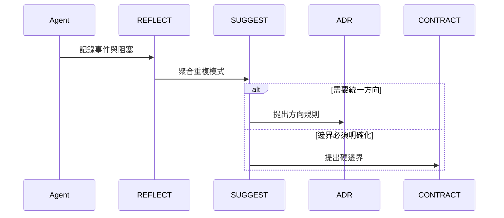

# 進階版

適用情況：

- 多個模組開始互相影響
- 問題已不再只是孤立 bug
- 多份 `REFLECT` 開始指向同一種結構問題
- 團隊需要判斷應該升級成 `ADR` 還是 `CONTRACT`

## 目標

進階版的作用，是把重複事件轉成正式治理候選。

如果你不確定，先讀 [Upgrade Signals](./upgrade-signals.md)，聚焦在 Signal 3 和 4。

## 啟用角色

- `REQ`
- `SPEC_STEP`
- `ADR`
- `CONTRACT`
- `REFLECT`
- `SUGGEST`

## 核心流程

## 這一版多了什麼

- `REFLECT` 成為治理證據來源
- `SUGGEST` 開始抽象模式
- 團隊必須判斷問題屬於方向問題還是邊界問題

## 升級判斷

升級成 `ADR`，當：

- 架構方向不明
- 實作策略持續漂移
- 模組責任需要一套共同說明

升級成 `CONTRACT`，當：

- 跨模組邊界持續被踩
- 資料責任不清楚
- 控制流開始污染其他模組

## 下一步

- [專業版](./README.professional.md)
- [Governance.md](./Governance.md)
