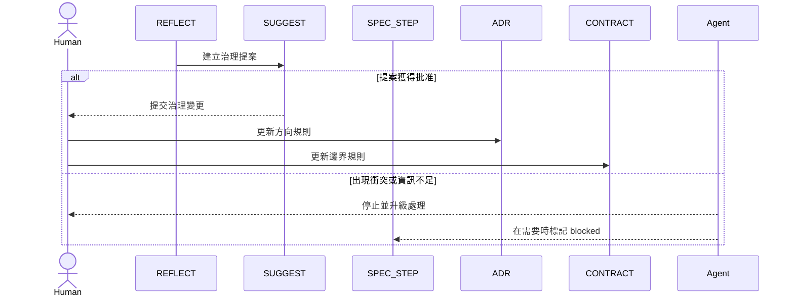

# 專業版

適用情況：

- 多個團隊或多個 milestone 共用同一套系統
- 文件衝突已經會阻斷交付
- 一個需求經常會影響另一個需求
- 需要正式批准與停機權限

## 目標

專業版的作用，是避免系統在錯的規則下繼續運行。

如果你不確定，先讀 [Upgrade Signals](./upgrade-signals.md)，聚焦在 Signal 5。

## 啟用角色

- `REQ`
- `SPEC_STEP`
- `ADR`
- `CONTRACT`
- `REFLECT`
- `SUGGEST`

## 核心流程

## 這一版多了什麼

- `PDR` 不再只是前置審查，而是治理閘門
- `SUGGEST` 可以提案，但不能自行生效
- `REQ`、`SPEC_STEP`、`ADR`、`CONTRACT` 之間任何不一致都會變成停機條件
- `GU` 前必須有人類批准

## 什麼時候專業版適合

使用這一版，當：

- 改動經常需要重新談判邊界
- 文件衝突會直接打斷交付
- 團隊需要正式批准權與升級路徑
- 如果繼續寫 code，只會把真正的治理問題藏起來

## 下一步

- [Governance.md](./Governance.md)
- [Conflict Handling](./conflict-handling.md)
- [Adoption Guide](./adoption-guide.md)
